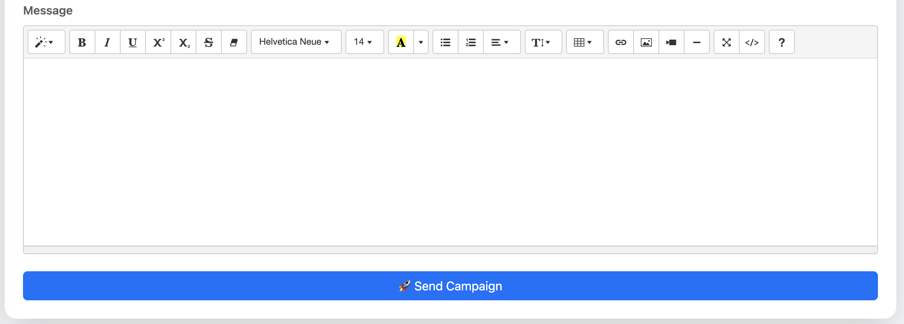
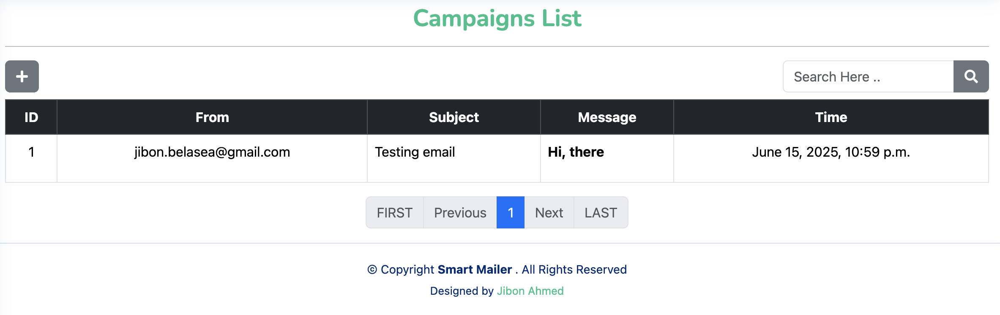
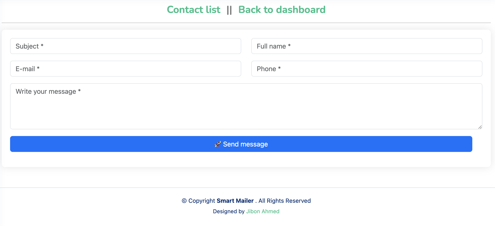
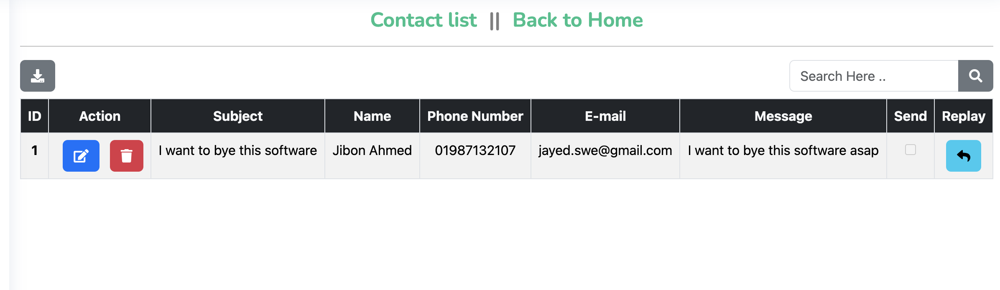
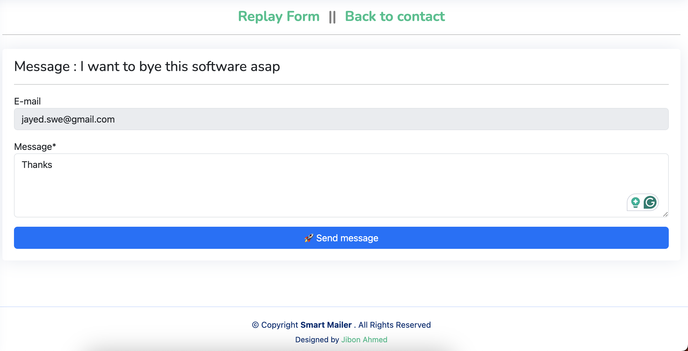
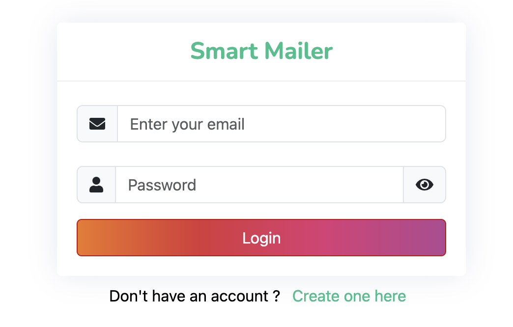
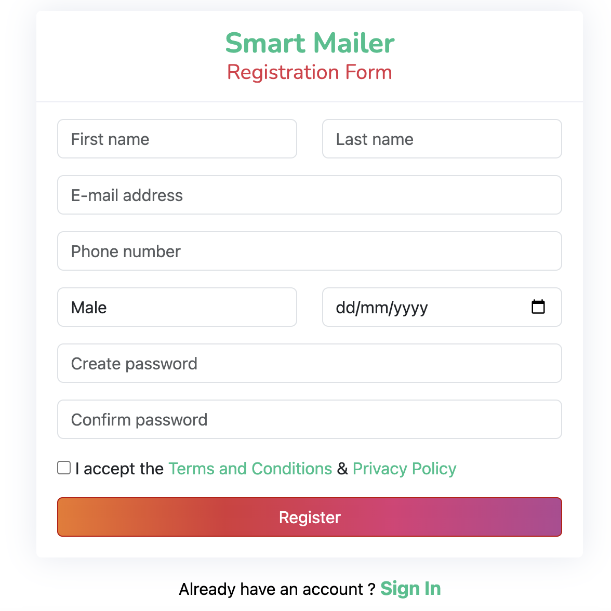
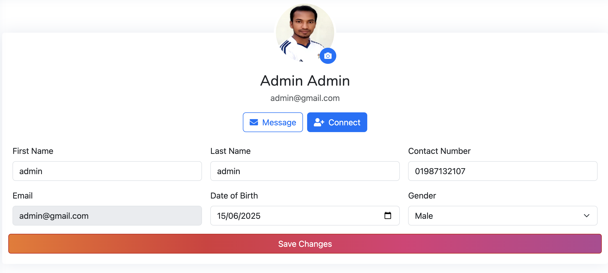

<h1 align="center" id='header'>Smart Mailer Software</h1>
<div align="center">
<!-- Gmail Account -->
<a href="mailto:jayed.swe@gmail.com">

</a>
<a href="tel:+8801987132107">

<a href="#" target="_blank">

</a>
<a href="https://www.facebook.com/jibon969" target="_blank">


<a href="https://www.linkedin.com/in/jibon969/" target="_blank">

</a>
<a href="https://github.com/jibon969" target="_blank">

</a>
</div>

<hr/>

#### 01. How to run this project

```
How to install packages and run this django project.
```

<details>
<summary style="cursor:pointer">Solution</summary>

```py
# Step 1 : Create virtualenv

# For Mac
python3 -m venv venv
source venv/bin/activate

# For windows
venv\Scripts\activate

# Step 2 : Clone project
git clone https://github.com/belasea/smart_mailer
cd smart_mailer


# Step 3 : Install Packages
pip install -r requirements.txt

# Step 4 : Run this project
python manage.py runserver

# Step 5 : makemigrations
python manage.py makemigrations
```

</details>

#### 02. Django PostgreSQL

```
Django PostgreSQL
```

<details>
<summary style="cursor:pointer">Solution</summary>

```py
# create database local_db
postgres=# create database local_db;
CREATE DATABASE
postgres=# \l

# Connect DB
postgres=# \c local_db;
You are now connected to database "local_db" as user "postgres".
# Show relations
local_db=# \d

# Django Settings.py
DATABASES = {
   'default': {
       'ENGINE': 'django.db.backends.postgresql',
       'NAME': 'local_db',
       'USER': 'postgres',
       'PASSWORD': 'root',
       'HOST': '127.0.0.1',
       'PORT': '5432',
   }
}
```

</details>

#### 03. Python shell script

```
Python shell script
```

<details>
<summary style="cursor:pointer">Solution</summary>

```py
# Create the setup.sh file using echo

echo @echo off > setup.sh

# Step 2: Open file using nano setup.sh

nano setup.sh

ctrl + x and Y then Enter

# Step 3: Make the script executable:

chmod +x setup.sh

# Step 4: Execute the script:

./setup.sh

```

</details>

<h3>Project ScreenShort </h3>
<hr/>











